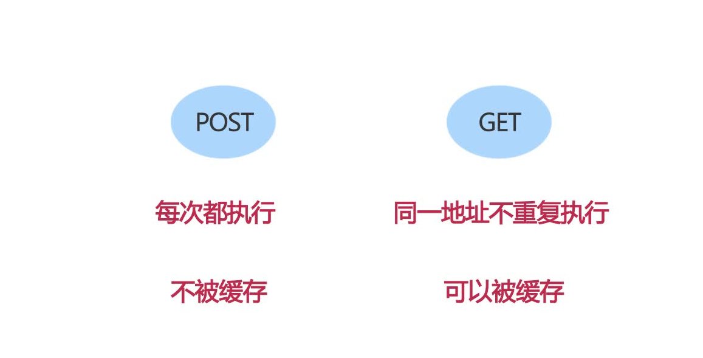

### 前端性能优化的目的

>1.从用户角度而言:优化能够让页面加载得更快、对用户的操作响应的更及时，能够给用户提供更为良好的体验。 
>2.从服务商角度而言:优化能够减少页面请求数、或者减小请求所占带宽，能够节省可观的资源。

##### 前端优化的方法有很多种，可以将其分为两大类，第一类是`页面级别的优化`如http请求数，内联脚本的位置优化等，第二类为`代码级别的优化`，例Java中的DOM 操作优化、CSS选择符优化、图片优化以及 HTML结构优化等等。

### 网页内容

#### 减少http请求次数

##### 80%的响应时间花在下载网页内容(images, stylesheets, javascripts, scripts, flash等)。减少请求次数是缩短响应时间的关键！可以通过简化页面设计来减少请求次数，但页面内容较多可以采用以下技巧。
>`捆绑文件`: 现在有很多现成的库可以帮你将多个脚本文件捆绑成一个文件，将多个样式表文件捆绑成一个文件，以此来减少文件的下载次数。当脚本或者样式表在不同页面中使用时需要做不同的修改，这可能会相对麻烦  点，但即便如此也要把这个方法作为改善页面性能的重要一步。
>`CSS Sprites`: 就是把多个图片拼成一副图片，这是减少图像请求的有效方法，把所有的背景图像都放到一个图片文件中，然后通过CSS的background-image和background-position属性来显示图片的不同部分；合并后的图片会比分离的图片总和要小，这是因为它降低了图片自身的开销。
>`Image Maps`： 也是将多幅图拼在一起，然后通过坐标来控制显示导航。虽然文件的总体大小不会改变，但是可以减少HTTP请求次数。图片地图只有在图片的所有组成部分在页面中是紧挨在一起的时候才能使用，如导航栏。确定图片的坐标和可能会比较繁琐且容易出错，同时使用图片地图导航也不具有可读性，因此不推荐这种方法。

#### 减少DNS查询次数(DNS缓存)

##### 在浏览器中输入一个域名，回车后，DNS（域名系统）会先将域名解析成对应的IP地址，然后根据IP地址去找到相应的网址。这样就完成了一个DNS查找，这个查找过程当然是要消耗时间的，大约消耗20毫秒，在这个查找过程中，我们的浏览器什么都不会做，保持一片空白。如果这样的查找很多，那么我们的网页性能将会受到很大影响，这就需要用到DNS缓存。 

>`现代的浏览器都有自己的缓存机制`： IE默认情况下对DNS查找记录的缓存时间为30分钟，Firefox默认情况下对DNS查找记录的缓存时间为1分钟，Chrome默认情况下对DNS查找记录的缓存时间为1分钟。

#### 避免页面跳转

##### 当客户端收到服务器的跳转回复时，客户端再次根据服务器回复中的location指定的地址再次发送请求，例如以下跳转回复。

      HTTP/1.1 301 Moved Permanently
      Location: http://example.com/newuri
      Content-Type: text/html

##### 当客户端遇到这种回复的时候，用户只能等待客户端再次发送请求，有的网站甚至会一直跳n次，跳到他想带你去的地方…当然在这个时候用户看不到任何页面内容，只有浏览器的进度条一直在刷新。

#### 使用内容分发网络(CDN–Content delivery network)

##### 内容分发网络是由一系列分散到各个不同地理位置上的Web服务器组成的，它提高了网站内容的传输速度。用于向用户传输内容的服务器主要是根据和用户在网络上的靠近程度来指定的。使用CDN，就相当于在离你最近的地方，放置一台性能好、连接顺畅的副本服务器，让你能够以最近的距离，最快的速度获取内容。有个缺点是：CDN服务成本却非常高，需要建立多台服务器。

#### 添加Expire/Cache-Control头

##### 首先说明一下：Expire属于HTTP/1.0，Cache-Control属于HTTP/1.1。这两者起到的作用是一致的。 
##### 通过使用Expires或者Cache-Control就可以使请求的内容具有缓存性，它避免了接下来的页面访问中不必要的HTTP请求。Expires头的内容是一个时间值，值就是资源在本地的过期时间。在当前时间还没有超过缓存资源的过期时间时，就直接使用这一缓存的资源，不会发送HTTP请求。Cache-Control的作用也是类似的，只不过它的值是一个表示距离缓存过期的一个秒数时间。

#### 启用Gzip压缩

##### 通过减小HTTP响应的大小也可以节省HTTP响应时间。Gzip可以压缩所有可能的文件类型，是减少文件体积、增加用户体验的简单方法。 
##### 从HTTP/1.1开始，web客户端都默认支持HTTP请求中有Accept-Encoding文件头的压缩格式：Accept-Encoding: gzip 
##### 如果web服务器在请求的文件头中检测到上面的代码，就会以客户端列出的方式压缩响应内容。Web服务器把压缩方式通过响应文件头中的Content-Encoding来返回给浏览器。 
##### `Content-Encoding: gzip`

#### 调整资源文件加载位置顺序（将css放在页面最上面，将script放在页面最下面）

##### 最好的方式是：在文档<head/>内加载你的样式表，这样做的好处是：提高网页渲染性能，避免网页出现白屏或者是没有样式的内容。

##### 将script标签放在页面底部（body结束标签之前），这样做可以让页面内容优先呈现出来，而非先暴露script脚本中可能存在的错误，能够带来更好的用户体验。此外即便脚本正确无误，但是脚本的加载和执行是阻塞的，如果需要加载的脚本过多，将会延长页面内容的加载时间，造成不好的用户体验。 

##### 将Script放在页面的最下面，因为浏览器加载和解释网页的顺序是从左到右从上到下的，如果JavaScript代码有死循环的问题，网页可能是空白一片的，如果放在页面的最下面即使如此，页面也能正常展现出来，用户体验更好。

#### 避免在CSS中使用Expressions

##### 表达式的问题就在于：它的计算频率要比我们想象的多。不仅仅是在页面显示和缩放时，就是在页面滚动、乃至移动鼠标时都会要重新计算一次。给CSS表达式增加一个计数器可以跟踪表达式的计算频率。在页面中随便移动鼠标都可以轻松达到10000次以上的计算量。 
##### 一个减少CSS表达式计算次数的方法就是使用一次性的表达式，它在第一次运行时将结果赋给指定的样式属性，并用这个属性来代替CSS表达式。如果样式属性必须在页面周期内动态地改变，使用事件句柄来代替CSS表达式是一个可行办法。如果必须使用CSS表达式，一定要记住它们要计算成千上万次并且可能会对你页面的性能产生影响。

#### 把JavaScript和CSS都放到外部文件中

#### 内联VS外置

##### 单独提取好处： 

>1.提高了js和css的复用性 
>2.减小页面体积 
>3.提高了js和css的可维护性

##### 内联的好处： 

>1.减少页面请求 
>2.提升页面渲染速度 

##### 使用内联的情况：

>1.脚本和样式只应用于一个页面 
>2.页面不经常被访问 
>3.脚本和样式很少的情况 

##### 在实际应用中使用外部文件可以提高页面速度，因为JavaScript和CSS文件都能在浏览器中产生缓存。内置在HTML文档中的JavaScript 和CSS则会在每次请求中随HTML文档重新下载。这虽然减少了HTTP请求的次数，却增加了HTML文档的大小。从另一方面来说，如果外部文件中的 JavaScript和CSS被浏览器缓存，在没有增加HTTP请求次数的同时可以减少HTML文档的大小。

#### 压缩 JavaScript 和 CSS

##### 压缩是指从去除代码不必要的字符减少文件大小从而节省下载时间： 

>1.去除不必要的空白符（空格、换行、tab缩进）、格式符、注释符 
>2.简写方法名、参数名来压缩js脚本 

##### 在 JavaScript中，由于需要下载的文件体积变小了从而节省了响应时间。

#### 避免重定向

##### 301(永久重定向)和302(临时重定向),这两个重定向用的比较多。 

##### 但是要记住重定向会降低用户体验。在用户和HTML文档中间增加一个跳转，会拖延页面中所有元素的显示，因为在HTML文件被加载前任何文件（图像、Flash等）都不会被下载。

#### 移除重复的脚本

##### 重复脚本会引起不必要的HTTP请求和无用的JavaScript运算，这降低了网站性能。

#### 配置实体标签（ETag）

##### Entity tag（ETag）（实体标签）是web服务器和浏览器用于判断浏览器缓存中的内容和服务器中的原始内容是否匹配的一种机制。如果一致，则直接使用缓存中的内容，不需要服务器提供了。 

##### 增加ETag为实体的验证提供了一个比使用”last-modified date（上次编辑时间）”更加灵活的机制。Etag是一个识别内容版本号的唯一字符串。唯一的格式限制就是它必须包含在双引号内。原始服务器通过含有 ETag文件头的响应指定页面内容的ETag。

      HTTP/1.1 200 OK 
      Last-Modified: Tue, 12 Dec 2015 03:03:59 GMT 
      ETag: "10c24bc-4ab-457e1c1f" 
      Content-Length: 12166 

##### 稍后，如果浏览器要验证一个文件，它会使用If-None-Match文件头来把ETag传回给原始服务器。在这个例子中，ETag是匹配的，就会返回一 个304状态码，这就节省了12166字节的响应。

      If-Modified-Since: Tue, 12 Dec 2006 03:03:59 GMT 
      If-None-Match: "10c24bc-4ab-457e1c1f" 

#### 使 AJAX 缓存

##### 首先来说一下get和post的区别： 

##### Ajax经常被提及的一个好处就是由于其从后台服务器传输信息的异步性而为用户带来的反馈的即时性。但是，使用Ajax并不能保证用户不会在等待异步的 JavaScript和XML响应上花费时间。在很多应用中，用户是否需要等待响应取决于Ajax如何来使用。记住一点，“异步”并不意味着”即时”，这很重要。 

##### 为了提高性能，优化Ajax响应是很重要的。提高Ajax性能的措施中最重要的方法就是使响应具有可缓存性(为文件头指定Expires或Cache-Control )。其它的几条规则也同样适用于Ajax：

>1.Gizp压缩文件
>2.减少DNS查找次数
>3.精简JavaScript
>4.避免跳转
>5.配置ETag(实体标签)

#### 延迟加载

##### 这里讨论延迟加载需要我们知道我们的网页最初加载需要的最小内容集是什么。剩下的内容就可以推到延迟加载的集合中。

##### Javascript是典型的可以延迟加载内容。一个比较激进的做法是开发网页时先确保网页在没有Javascript的时候也可以基本工作，然后通过延迟加载脚本来完成一些高级的功能。

#### 提前加载

##### 与延迟加载目的相反，提前加载的是为了提前加载接下来网页中访问的资源，下面是提前加载的类型

##### `无条件提前加载`：当前网页加载完成后，马上去下载一些其他的内容。例如google会在页面加载成功之后马上去下载一个所有结果中会用到的image sprite。

##### `有条件加载`：根据用户的输入推断需要加载的内容，雅虎的示例是search.yahoo.com，

##### `有预期的的加载`：这种情况一般发生在网页重新设计时，由于用户经常访问旧网页，本地对旧的网页内容缓存充分从而显得旧网页速度很快，而新的网页内容却没有缓存，设计者可以在旧网页的内容中预先加载一些新网页中可能用到的内容，这样新的网页就会生下来一些需要下载的资源。

#### 减少DOM元素数量

##### 网页中元素过多对网页的加载和脚本的执行都是沉重的负担，500个元素和5000个元素在加载速度上会有很大差别。

##### 想知道你的网页中有多少元素，通过在浏览器中的一条简单命令就可以算出，

      document.getElementsByTagName('*').length

#### 根据域名划分内容

##### 浏览器一般对同一个域的下载连接数有所限制，按照域名划分下载内容可以浏览器增大并行下载连接，但是注意控制域名使用在2-4个之间，不然dns查询也是个问题。

##### 一般网站规划会将静态资源放在类似于static.example.com，动态内容放在www.example.com上。这样做还有一个好处是可以在静态的域名上避免使用cookie。后面我们会在cookie的规则中提到。

#### 减少iframe数量
##### 使用iframe要注意理解iframe的优缺点

##### `优点`

>1.可以用来加载速度较慢的内容，例如广告。
>2.安全沙箱保护。浏览器会对iframe中的内容进行安全控制。
>3.脚本可以并行下载

##### `缺点`

>1.即使iframe内容为空也消耗加载时间
>2.会阻止页面加载
>3.没有语义

#### 避免404

##### 404我们都不陌生，代表服务器没有找到资源，我们要特别要注意404的情况不要在我们提供的网页资源上，客户端发送一个请求但是服务器却返回一个无用的结果，时间浪费掉了。

##### 更糟糕的是我们网页中需要加载一个外部脚本，结果返回一个404，不仅阻塞了其他脚本下载，下载回来的内容(404)客户端还会将其当成Javascript去解析。

#### 尽早flush输出

##### 网页后台程序中我们知道有个方法叫Response.Flush()，一般我们调用它都是在程序末尾，但注意这个方法可以被调用多次。目的是可以将现有的缓存中的回复内容先发给客户端，让客户端“有活干”。

##### 那在什么时候调用这个方法比较好呢？一般情况下我们可以在对于需要加载比较多外部脚本或者样式表时可以提前调用一次，客户端收到了关于脚本或其他外部资源的链接可以并行的先发请求去下载，服务器接下来把后续的处理结果发给客户端。

#### 避免空的图片src
##### 空的图片src仍然会使浏览器发送请求到服务器，这样完全是浪费时间，而且浪费服务器的资源。尤其是你的网站每天被很多人访问的时候，这种空请求造成的伤害不容忽略。

##### 浏览器如此实现也是根据RFC 3986 - Uniform Resource Identifiers标准，空的src被定义为当前页面。

##### 所以注意我们的网页中是否存在这样的代码

      straight HTML 
      

      JavaScript 
      var img = new Image(); 
      img.src = "";

#### 减少Cookie大小
##### Cookie被用来做认证或个性化设置，其信息被包含在http报文头中，对于cookie我们要注意以下几点，来提高请求的响应速度，

>1.去除没有必要的cookie，如果网页不需要cookie就完全禁掉
>2.将cookie的大小减到最小
>3.注意cookie设置的domain级别，没有必要情况下不要影响到sub-domain
>4.设置合适的过期时间，比较长的过期时间可以提高响应速度。

#### 页面内容使用无cookie域名
##### 大多数网站的静态资源都没必要cookie，我们可以采用不同的domain来单独存放这些静态文件，这样做不仅可以减少cookie大小从而提高响应速度，还有一个好处是有些proxy拒绝缓存带有cookie的内容，如果能将这些静态资源cookie去除，那就可以得到这些proxy的缓存支持。

##### 常见的划分domain的方式是将静态文件放在static.example.com，动态内容放在www.example.com。

##### 也有一些网站需要在二级域名上应用cookie，所有的子域都会继承，这种情况下一般会再购买一个专门的域名来存放cookie-free的静态资源。例如Yahoo!的yimg.com，YouTube的ytimg.com等。

### CSS
#### 将样式表置顶
##### 经样式表(css)放在网页的HEAD中会让网页显得加载速度更快，因为这样做可以使浏览器逐步加载已将下载的网页内容。这对内容比较多的网页尤其重要，用户不用一直等待在一个白屏上，而是可以先看已经下载的内容。

##### 如果将样式表放在底部，浏览器会拒绝渲染已经下载的网页，因为大多数浏览器在实现时都努力避免重绘，样式表中的内容是绘制网页的关键信息，没有下载下来之前只好对不起观众了。

#### 避免CSS表达式
##### CSS表达式可以动态的设置CSS属性，在IE5-IE8中支持，其他浏览器中表达式会被忽略。例如下面表达式在不同时间设置不同的背景颜色。

      background-color: expression( (new Date()).getHours()%2 ? "#B8D4FF" : "#F08A00" );

##### CSS表达式的问题在于它被重新计算的次数远比我们想象的要多，不仅在网页绘制或大小改变时计算，即使我们滚动屏幕或者移动鼠标的时候也在计算，因此我们还是尽量避免使用它来防止使用不当而造成的性能损耗。

##### 如果想达到类似的效果我们可以通过简单的脚本做到。

      <html>
        <head>
        </head>
        <body>
          
        </body>
      </html>

#### 用`<link>`代替`@import`
##### 避免使用`@import`的原因很简单，因为它相当于将css放在网页内容底部。

#### 避免使用`Filters`
##### AlphaImageLoad也是IE5.5 - IE8中支持，这种滤镜的使用会导致图片在下载的时候阻塞网页绘制，另外使用这种滤镜会导致内存使用量的问题。IE9中已经不再支持。