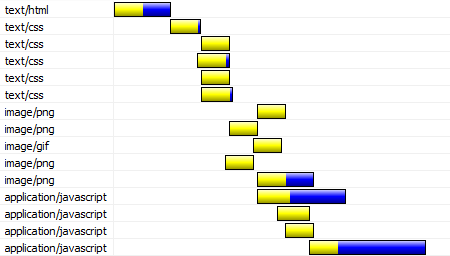
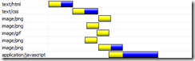
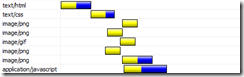

### 前端性能优化的目的

>1.从用户角度而言:优化能够让页面加载得更快、对用户的操作响应的更及时，能够给用户提供更为良好的体验。 
>2.从服务商角度而言:优化能够减少页面请求数、或者减小请求所占带宽，能够节省可观的资源。

##### 前端优化的方法有很多种，可以将其分为两大类，第一类是`页面级别的优化`如http请求数，内联脚本的位置优化等，第二类为`代码级别的优化`，例Java中的DOM 操作优化、CSS选择符优化、图片优化以及 HTML结构优化等等。

### Javascript

#### 将脚本置底

##### `HTTP/1.1 specification`建议浏览器对同一个hostname不要超过两个并行下载连接， 所以当你从多个domain下载图片的时候可以提高并行下载连接数量。但是当脚本在下载的时候，即使是来自不同的hostname浏览器也不会下载其他资源，因为浏览器要在脚本下载之后依次解析和执行。

##### 因此对于脚本提速，我们可以考虑以下方式，

>1.把脚本置底，这样可以让网页渲染所需要的内容尽快加载显示给用户。
>2.现在主流浏览器都支持defer关键字，可以指定脚本在文档加载后执行。
>3.HTML5中新加了async关键字，可以让脚本异步执行。

#### 使用外部`Javascirpt`和`CSS`文件

##### 使用外部`Javascript`和`CSS`文件可以使这些文件被浏览器缓存，从而在不同的请求内容之间重用。

##### 同时将`Javascript`和`CSS`从`inline`变为`external`也减小了网页内容的大小。

##### 使用外部Javascript和`CSS`文件的决定因素在于这些外部文件的重用率，如果用户在浏览我们的页面时会访问多次相同页面或者可以重用脚本的不同页面，那么外部文件形式可以为你带来很大的好处。但对于用户通常只会访问一次的页面，例如`microsoft.com`首页，那`inline`的`javascript`和`css`相对来说可以提供更高的效率。

#### 精简Javascript和CSS

##### 精简就是将Javascript或CSS中的空格和注释全去掉，

      body {
          line-height: 1;
      }
      ol, ul {
          list-style: none;
      }
      blockquote, q {
          quotes: none;
      }

##### `精简后版本`

      body{line-height:1}ol,ul{list-style:none}blockquote,q{quotes:none}

##### 统计表明精简后的文件大小平均减少了21%，即使在应用Gzip的文件也会减少5%。

##### 例如我的网站上有5个CSS，4个Javascirpt，下面是分别经过bundling和minify之后的结果。

| 没有任何处理之前    | 捆绑Javascript和CSS之后 |  精简Javascript和CSS之后  |
| :------: | :------------------------------------: | :----: |
|   |  |  |

##### 用来帮助我们做精简的工具很多，主要可以参考如下，

##### JS compressors:

>1.Packer
>2.JSMin
>3.Closure compiler
>4.YUICompressor (also does CSS)
>5.AjaxMin (also does CSS)

##### CSS compressors:

>1.CSSTidy
>2.Minify
>3.YUICompressor (also does JS)
>4.AjaxMin (also does JS)
>5.CSSCompressor

##### 与VS集成比较好的工具如下.

>1.YUICompressor - 编译集成，包含在NuGet.
>2.AjaxMin  - 编译集成

#### 去除重复脚本

##### 重复的脚本不仅浪费浏览器的下载时间，而且浪费解析和执行时间。一般用来避免引入重复脚本的做法是使用统一的脚本管理模块，这样不仅可以避免重复脚本引入，还可以兼顾脚本依赖管理和版本管理。

#### 减少DOM访问

##### 通过Javascript访问DOM元素没有我们想象中快，元素多的网页尤其慢，对于Javascript对DOM的访问我们要注意

>1.缓存已经访问过的元素
>2.Offline更新节点然后再加回DOM Tree
>3.避免通过Javascript修复layout

#### 使用智能事件处理

##### 这里说智能的事件处理需要开发者对事件处理有更深入的了解，通过不同的方式尽量少去触发事件，如果必要就尽早的去处理事件。

##### 比如一个div中10个按钮都需要事件句柄，那么我们可以将事件放在div上，在事件冒泡过程中捕获该事件然后判断事件来源。