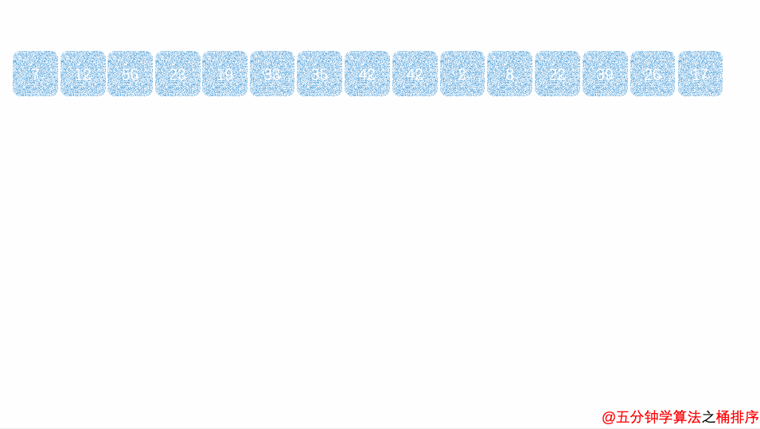

### 桶排序（Bucket Sort）

##### 桶排序是计数排序的升级版。它利用了函数的映射关系，高效与否的关键就在于这个映射函数的确定。桶排序 (Bucket sort)的工作的原理：假设输入数据服从均匀分布，将数据分到有限数量的桶里，每个桶再分别排序（有可能再使用别的排序算法或是以递归方式继续使用桶排序进行排）。

#### 算法描述

>设置一个定量的数组当作空桶；
>遍历输入数据，并且把数据一个一个放到对应的桶里去；
>对每个不是空的桶进行排序；
>从不是空的桶里把排好序的数据拼接起来。 

#### 动图演示

#### 代码实现

    function bucketSort(arr, bucketSize) {
        if (arr.length === 0) {
          return arr;
        }
    
        var i;
        var minValue = arr[0];
        var maxValue = arr[0];
        for (i = 1; i < arr.length; i++) {
          if (arr[i] < minValue) {
              minValue = arr[i];                // 输入数据的最小值
          } else if (arr[i] > maxValue) {
              maxValue = arr[i];                // 输入数据的最大值
          }
        }
    
        // 桶的初始化
        var DEFAULT_BUCKET_SIZE = 5;            // 设置桶的默认数量为5
        bucketSize = bucketSize || DEFAULT_BUCKET_SIZE;
        var bucketCount = Math.floor((maxValue - minValue) / bucketSize) + 1;  
        var buckets = new Array(bucketCount);
        for (i = 0; i < buckets.length; i++) {
            buckets[i] = [];
        }
    
        // 利用映射函数将数据分配到各个桶中
        for (i = 0; i < arr.length; i++) {
            buckets[Math.floor((arr[i] - minValue) / bucketSize)].push(arr[i]);
        }
    
        arr.length = 0;
        for (i = 0; i < buckets.length; i++) {
            insertionSort(buckets[i]);                      // 对每个桶进行排序，这里使用了插入排序
            for (var j = 0; j < buckets[i].length; j++) {
                arr.push(buckets[i][j]);                     
            }
        }
    
        return arr;
    }

#### 算法分析

##### 桶排序最好情况下使用线性时间O(n)，桶排序的时间复杂度，取决与对各个桶之间数据进行排序的时间复杂度，因为其它部分的时间复杂度都为O(n)。很显然，桶划分的越小，各个桶之间的数据越少，排序所用的时间也会越少。但相应的空间消耗就会增大。 