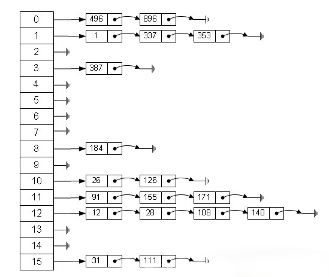

### 散列表

##### 散列表，也叫哈希表，是根据关键码和值 (key和value) 直接进行访问的数据结构，通过key和value来映射到集合中的一个位置，这样就可以很快找到集合中的对应元素。

#### 记录的存储位置=f(key)

##### 这里的对应关系 f 成为散列函数，又称为哈希 (hash函数)，而散列表就是把Key通过一个固定的算法函数既所谓的哈希函数转换成一个整型数字，然后就将该数字对数组长度进行取余，取余结果就当作数组的下标，将value存储在以该数字为下标的数组空间里，这种存储空间可以充分利用数组的查找优势来查找元素，所以查找的速度很快。

##### 哈希表在应用中也是比较常见的，就如Java中有些集合类就是借鉴了哈希原理构造的，例如HashMap，HashTable等，利用hash表的优势，对于集合的查找元素时非常方便的，然而，因为哈希表是基于数组衍生的数据结构，在添加删除元素方面是比较慢的，所以很多时候需要用到一种数组链表来做，也就是拉链法。拉链法是数组结合链表的一种结构，较早前的hashMap底层的存储就是采用这种结构，直到jdk1.8之后才换成了数组加红黑树的结构，其示例图如下： 

##### 从图中可以看出，左边很明显是个数组，数组的每个成员包括一个指针，指向一个链表的头，当然这个链表可能为空，也可能元素很多。我们根据元素的一些特征把元素分配到不同的链表中去，也是根据这些特征，找到正确的链表，再从链表中找出这个元素。

##### 哈希表的应用场景很多，当然也有很多问题要考虑，比如哈希冲突的问题，如果处理的不好会浪费大量的时间，导致应用崩溃。