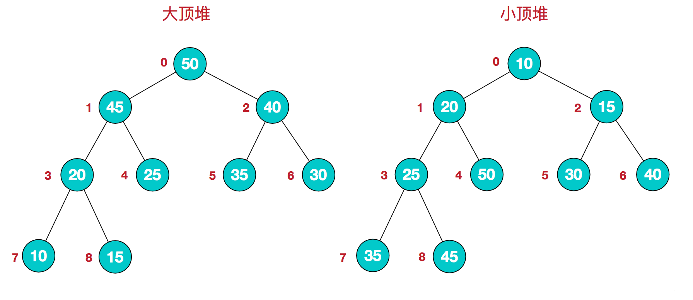

### 堆

##### 堆是一种比较特殊的数据结构，可以被看做一棵树的数组对象，具有以下的性质：

>堆中某个节点的值总是不大于或不小于其父节点的值；
>堆总是一棵完全二叉树。

##### 将根节点最大的堆叫做最大堆或大根堆，根节点最小的堆叫做最小堆或小根堆。常见的堆有二叉堆、斐波那契堆等。

##### 堆的定义如下：n个元素的序列{k1,k2,ki,…,kn}当且仅当满足下关系时，称之为堆。 
##### (ki <= k2i,ki <= k2i+1)或者(ki >= k2i,ki >= k2i+1), (i = 1,2,3,4…n/2)，满足前者的表达式的成为小顶堆，满足后者表达式的为大顶堆，这两者的结构图可以用完全二叉树排列出来，示例图如下： 

##### 因为堆有序的特点，一般用来做数组中的排序，称为堆排序。