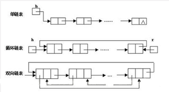

### 链表

##### 链表是物理存储单元上非连续的、非顺序的存储结构，数据元素的逻辑顺序是通过链表的指针地址实现，每个元素包含两个结点，一个是存储元素的数据域 (内存空间)，另一个是指向下一个结点地址的指针域。根据指针的指向，链表能形成不同的结构，例如单链表，双向链表，循环链表等。

链表的优点： 
链表是很常用的一种数据结构，不需要初始化容量，可以任意加减元素； 
添加或者删除元素时只需要改变前后两个元素结点的指针域指向地址即可，所以添加，删除很快；

缺点： 
因为含有大量的指针域，占用空间较大； 
查找元素需要遍历链表来查找，非常耗时。

适用场景： 
数据量较小，需要频繁增加，删除操作的场景