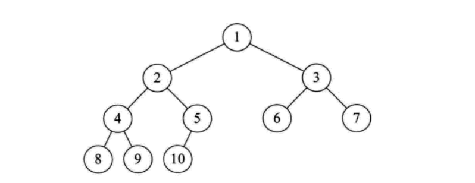

### 树

##### 树是一种数据结构，它是由n（n>=1）个有限节点组成一个具有层次关系的集合。把它叫做 “树” 是因为它看起来像一棵倒挂的树，也就是说它是根朝上，而叶朝下的。它具有以下的特点：

>1.每个节点有零个或多个子节点；
>2.没有父节点的节点称为根节点；
>3.每一个非根节点有且只有一个父节点；
>4.除了根节点外，每个子节点可以分为多个不相交的子树；

##### 在日常的应用中，我们讨论和用的更多的是树的其中一种结构，就是`二叉树`。

#### 二叉树是树的特殊一种，具有如下特点：

>1、每个结点最多有两颗子树，结点的度最大为2。 
>2、左子树和右子树是有顺序的，次序不能颠倒。 
>3、即使某结点只有一个子树，也要区分左右子树。

##### 二叉树是一种比较有用的折中方案，它添加，删除元素都很快，并且在查找方面也有很多的算法优化，所以，二叉树既有链表的好处，也有数组的好处，是两者的优化方案，在处理大批量的动态数据方面非常有用。

#### 扩展： 
##### 二叉树有很多扩展的数据结构，包括平衡二叉树、红黑树、B+树等，这些数据结构二叉树的基础上衍生了很多的功能，在实际应用中广泛用到，例如mysql的数据库索引结构用的就是B+树，还有HashMap的底层源码中用到了红黑树。这些二叉树的功能强大，但算法上比较复杂，想学习的话还是需要花时间去深入的。